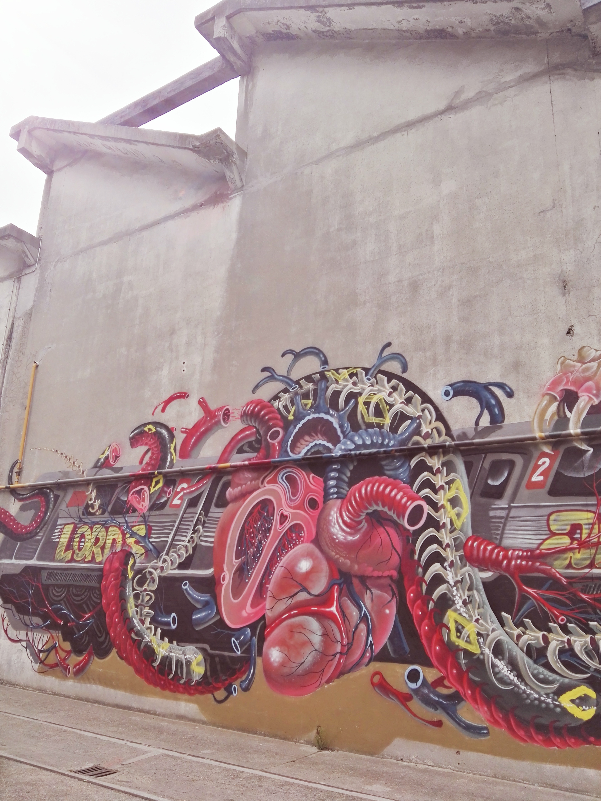

Grand train est un immense bar/resto qui se trouve dans le 18ème au 26 ter, rue Ordener.
Ce bar (appelons le bar pour plus de simplicité car on aime la simplicité) n'est qu'éphémère. Il est ouvert du 30 avril au 16 octobre. Au programme, moultes activités sont disponibles.

On peut prendre à manger dans l'un des 10 différents restaurants prévus sur place et aller déguster le tout sur des rails. Des tables de ping-pong et des baby-foot sont également mise à disposition. Le tout, arrosé de la boisson de votre choix (bières locales, vins, ...). Des évènements sont régulièrement organisé avec la liste des infos sur le [site Facebook](https://www.facebook.com/grandtrain/events/)

<iframe src="https://www.google.com/maps/embed?pb=!1m18!1m12!1m3!1d2623.277516689977!2d2.3512628156755597!3d48.89104807929083!2m3!1f0!2f0!3f0!3m2!1i1024!2i768!4f13.1!3m3!1m2!1s0x0000000000000000%3A0x079e1a57137a7800!2sGrand+train!5e0!3m2!1sfr!2sfr!4v1466352367877" height="450" frameborder="0" style="border:0; width:90%; max-width:600px;" allowfullscreen></iframe>

Site officiel : [Grand train](http://www.grandtrain.com/)

